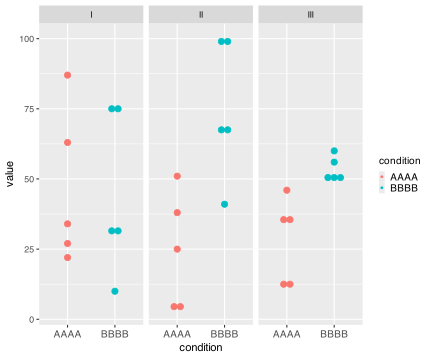
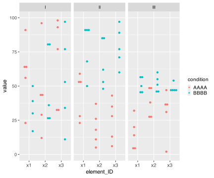
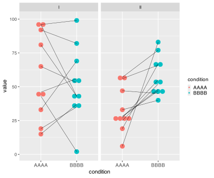
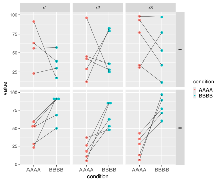
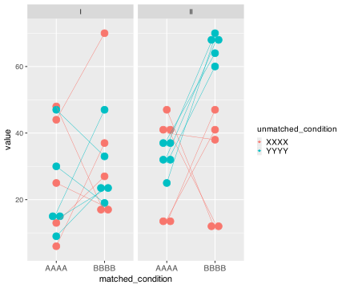
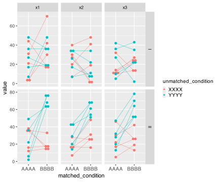
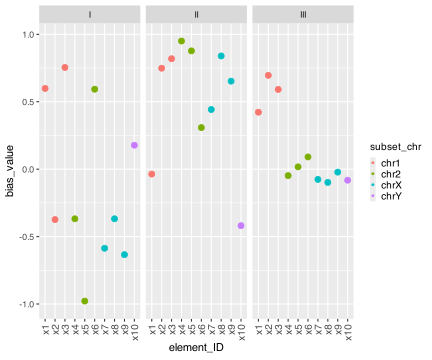

## Installation

You can install the development version of MCWtests from
[GitHub](https://github.com/) with:

``` r
# install.packages("devtools")
devtools::install_github("diazcastillo/MCWtests")
```

# Introduction to MCW testing

Originally, Monte Carlo-Wilcoxon (MCW) tests were designed to determined
whether the differences between two sets of data were significantly
biased in the same direction when compared with what it would be
expected by chance. MCW tests proceed by calculating sum-of-ranks-based
bias indexes, hence the reference to Frank Wilcoxon who invented the
non-parametric rank-sum and signed-rank tests, before and after
rearranging the dataset multiple times, hence the Monte Carlo reference
often associated to analytical strategies based on repeated random
sampling(Díaz-Castillo 2013, 2017, 2018; Chamorro-Garcia et al. 2017;
Diaz-Castillo et al. 2019).

The *MCWtests* package encompasses the original MCW test and three
variations that differ in the data structures and the specific questions
they interrogate.

- The **matched-measures univariate MCW (muMCW)** **test**, the original
  MCW test, assesses whether one set of inherently matched-paired
  measures is significantly biased in the same direction(Díaz-Castillo
  2013, 2017, 2018; Chamorro-Garcia et al. 2017; Diaz-Castillo et al.
  2019). For instance, muMCW tests can be used to analyze bodyweights or
  transcript abundances determined at two different timepoints for the
  same set of mice.

- The **unmatched-measures MCW (uMCW) test** assesses whether two sets
  of unmatched measures and their heterogeneity are significantly biased
  in the same direction. For instance, uMCW tests can be used to analyze
  bodyweights or transcript abundances determined for two sets of mice
  that have been maintained in different conditions.

- The **matched-measures bivariate MCW (mbMCW) test** assesses whether
  two sets of inherently matched-paired measures are significantly
  differentially biased in the same direction. For instance, mbMCW tests
  can be used to analyze bodyweights or transcript abundances determined
  at two different timepoints for two sets of mice that have been
  exposed to different conditions.

- The **bias-measures MCW (bMCW) test** assesses whether a set of
  measures of bias for a quantitative trait between two conditions or a
  subset of these bias measures are themselves significantly biased in
  the same direction. For instance, bMCW tests can be used to analyze
  bias indexes obtained using other MCW tests or fold change for
  transcript abundances spanning the entire transcriptome or only for
  genes located in specific genomic regions from two sets of mice
  exposed to different conditions.

# MCW testing process

Although each MCW test examines distinct data structures to address
slightly different questions, all MCW tests share two fundamental steps:

1.  **To quantitatively determine the extent and direction of the bias
    of the measure under analysis**, MCW tests calculate a bias index
    (BI) by summing ranks and dividing these sums by the maximum
    possible value of the sums. Consequently, BIs range from 1 to -1
    when the measure under analysis is completely biased in each
    possible direction.

2.  **To determine the significance of the BIs calculated for the
    user-provided dataset (observed BIs)**, a collection of
    expected-by-chance BIs is generated by rearranging the original
    dataset multiple times and calculating BIs for each iteration.
    *P<sub>upper</sub>* and *P<sub>lower</sub>* values are calculated as
    the fractions of expected-by-chance BIs that have values higher or
    equal to and lower or equal to the observed BIs, respectively.

Each MCW test employs the user-provided parameter *max_rearrangements*
to follow two alternative paths.

- **MCW exact tests.** If the number of distinct rearrangements that can
  be generated from the dataset under analysis is less than
  *max_rearrangements*, MCW tests will actually generate all possible
  data rearrangements to create the collection of expected-by-chance
  BIs. In this case, *P<sub>upper</sub>* and *P<sub>lower</sub>* values
  will be exact estimations of the likelihood of obtaining BIs with
  equal or more extreme values compared to observed BIs with datasets of
  the same size and range but different internal structures.

- **MCW approximated tests.** If the number of distinct rearrangements
  that can be generated from the dataset under analysis is greater than
  *max_rearrangements*, MCW tests will perform a specified number of
  random data rearrangements, equal to the value of
  *max_rearrangements*, to generate the collection of expected-by-chance
  BIs. In this case, *P<sub>upper</sub>* and *P<sub>lower</sub>* values
  will represent approximate estimations of the likelihood of obtaining
  BIs with equal or more extreme values compared to observed BIs with
  datasets of the same size and range but different internal structures.

# 3. MCWtests data and function structure

Each MCW test involves two local files, one exported function that users
interacts with, and several internal functions that perform specific
tasks.

1.  **Local files:**

- **Entry CSV dataset**. Users provide data for MCW testing in a CSV
  file in the directory of their choice. This file can contain data for
  a single MCW test or multiple MCW tests to be executed simultaneously.
  Users can organize the entry dataset in two different layouts,
  vertical or horizontal, which is particularly useful for simultaneous
  testing when the data structures for each individual test are
  significantly different or very similar, respectively.

- **Results CSV table**. MCW test functions create a CSV file with the
  results of MCW testing, with a similar name to the entry CSV dataset
  file, in the same directory where the entry CSV is located.

2.  **Exported functions:**

- ***MCWtest*** **function**: When executing this function, users must
  specify the path to the CSV file containing the entry dataset and the
  parameter *max_rearrangements*. The *MCWtest* function interprets this
  parameter as the maximum number of data rearrangement iterations used
  to define the size of the collection of expected-by-chance BIs. The
  *MCWtest* function performs the following tasks:

  - It loads the entry CSV dataset.
  - It determines whether MCW tests will proceed using the exact or
    approximated testing paths.
  - It calls the corresponding functions, *MCW_exact_test* and
    *MCW_approximated_test*, to run the exact and approximated tests,
    resepctively.
  - It writes the results of MCW testing to a CSV file in the same
    directory as the entry CSV file.

3.  **Internal functions:**

- ***MCW_exact_test*** **function**: This function is called when the
  number of distinctive data rearrangements is less than the
  user-provided parameter *max_rearrangements*. The *MCW_exact_test*
  function performs the following tasks:

  - It generates all distinctive data rearrangements, either on its own
    or by executing the *MCW_exact_test_combinations* function.
  - It calculates BIs for the user-provided data and each of the
    distinctive rearrangements of the dataset.
  - It calculates the *P<sub>upper</sub>* and *P<sub>lower</sub>* values
    as the fractions of expected-by-chance BIs with values higher or
    equal to and lower or equal to the observed BIs, respectively.
  - It returns the MCW exact testing results to the *MCWtest* function.

- ***MCW_exact_test_combinations*** **function**: This function is
  called to assist the *MCW_exact_test* function in generating all
  distinctive data rearrangements.

- ***MCW_approximated_test*** **function**: This function is called when
  the number of distinctive data rearrangements is greater than the
  user-provided parameter *max_rearrangements*. The
  *MCW_approximated_test* function performs the following tasks:

  - It calls the *MCW_approximated_test_observed_BIs* function to
    calculate BIs for the user-provided dataset.
  - It calls the *MCW_approximated_test_simulated_BIs* function to
    randomly rearrange the data and calculate the expected-by-chance BIs
    a specified number of times, which is equal to *max_rearrangements*.
  - It calculates the *P<sub>upper</sub>* and *P<sub>lower</sub>* values
    as the fractions of expected-by-chance BIs with values higher or
    equal to and lower or equal to the observed BIs, respectively.
  - It returns the MCW approximated testing results to the *MCWtest*
    function

- ***MCW_approximated_test_observed_BIs*** **function**: This function
  is called to calculate BIs for the user-provided dataset.

- ***MCW_approximated_test_simulated_BIs*** **function**: This function
  is called N times, where N = *max_rearrangements*, to randomly
  rearrange the data and calculate the expected-by-chance BIs using the
  *MCW_approximated_test_observed_BIs* function.

# 4. Specific MCW tests

## 4.1 unmatched-measures MCW (uMCW) test

### Introduction

The uMCW test is actually a combination of two different tests that
assess whether two sets of unmatched measures and their heterogeneity
are significantly biased in the same direction. Significantly different
data heterogeneities between two conditions could indicate that the
measure under analysis is more constrained or more relaxed in one of the
conditions, potentially providing insights into the mechanisms
underlying the variation of such measure. For instance, uMCW tests can
be used to analyze bodyweights or transcript abundances determined for
two sets of mice that have been maintained in different conditions.

### uMCW testing entry dataset formatting

When executing the *uMCWtest* function, users must provide the path to a
local CSV file named *X_uMCWtest_data.csv*, where *X* serves as a
user-defined identifier. *X_uMCWtest_data.csv* can be structured in two
distinct formats:

- **Vertical layout**: This format allows appending datasets with
  varying structures, such as different numbers of measures per set or
  between each appended test. Vertical entry datasets should include the
  following columns:

  - The *condition* column uniquely identifies each of the two measure
    sets under analysis.
  - The *value* column contains the actual measures under analysis.
  - As many informative columns as needed by users to contextualize the
    results of each test. The names of these columns should not include
    the terms *condition* or *value*. While these columns are optional
    when running a single test, at least one column is required when
    running multiple tests simultaneously. All rows for each individual
    test must contain the same information in these columns.

- **Horizontal layout**: This format allows appending datasets with
  similar structures, such as the same number of measures collected for
  each of the two conditions. Horizontal entry datasets should include
  the following columns:

  - Columns *condition_a* and *condition_b* uniquely identify the two
    measure sets under analysis.
  - Columns *a.i* and *b.j*, where *i* and *j* represent integers to
    differentiate specific measures within each set, contain the actual
    measures under analysis.
  - As many informative columns as needed by users to contextualize the
    results of each test. The names of these columns should not contain
    the term *condition* or have the same structure as the *a.i* and
    *b.j* columns. While these columns are optional when running a
    single test, at least one column is required when running multiple
    tests simultaneously.

### uMCW testing process

The function *uMCWtest* eliminate missing values (NAs) from the dataset
before proceeding these steps.

- To estimate the bias between the two sets of measures (*e.g.*, *a* and
  *b*), the function *uMCWtest* performs these tasks:

  - It generates all possible disjoint data pairs using measures from
    both sets.
  - For each measure pair, it subtracts the second measure in the pair
    from the first measure in the pair.
  - It ranks the absolute values of all non-zero measure pair
    differences from lowest to highest. Measure pair differences with a
    value of 0 are assigned a 0 rank. If multiple measure pair
    differences have the same absolute value, all tied measure pair
    differences are assigned the lowest rank possible.
  - It assigns each measure pair rank a sign based on the sign of its
    corresponding measure pair difference.
  - It sums the signed ranks for measure pairs formed with measures from
    the two different sets (*e.g.*, *a-b* and *b-a*).
  - For each type of disjoint set measure pairs (*e.g.*, *a-b* and
    *b-a*), it calculates uMCW_BI by dividing the sum of signed ranks by
    the maximum number this sum could have if the corresponding measure
    pairs had the highest possible positive ranks. Consequently, uMCW_BI
    ranges between 1 when all the values for measures in the first set
    are higher than all the values from measures in the second set, and
    -1 when all the values for measures in the first set are lower than
    all the values from measures in the second set.

- To estimate the bias between the heterogeneity of two sets of
  measures, the function *uMCWtest* performs these tasks:

  - It generates all possible disjoint data pairs within each set,
    disregarding the order of the paired measures. For instance, the
    measure pair *a.1-a.2* is considered equivalent to the measure pair
    *a.2-a.1*, and only the former is retained for the subsequent
    calculations.
  - For each measure pair, it subtracts the second measure from the
    first measure.
  - It ranks all measure pair differences with non-zero values from
    lowest to highest. Measure pair differences with a value of 0 are
    assigned a 0 rank. If multiple measure pair differences have the
    same absolute value, *uMCWtest* assigns all tied measure pair
    differences the lowest rank possible.
  - It sums ranks for measure pairs formed with measures from the same
    set (*e.g.*, *a-a* and *b-b*).
  - For each type of same-set measure pairs (*e.g.*, *a-a* and *b-b*),
    it divides each sum of signed ranks by the maximum number this sum
    could have if the corresponding measure pairs had the highest
    possible ranks.
  - It calculates two heterogeneity bias indexes (uMCW_HBIs) by
    subtracting the normalized sum of signed ranks from the previous
    step in two possible directions (*e.g.*, *a-b* and *b-a*).
    Consequently, uMCW_HBI ranges between 1 when at least two measures
    in the first set have distinct values and all measures in the second
    set have the same value, and -1 when all measures in the first set
    have the same value and at least two measures in the second set have
    distinct values.

- To assess the significance of the uMCW_BIs and uMCW_HBIs obtained with
  the user-provided data (observed uMCW_BIs and uMCW_HBIs), the function
  *uMCWtest* performs these tasks:

  - It generates a collection of expected-by-chance uMCW_BIs and
    uMCW_HBIs. These expected values are obtained by rearranging the
    measures between the two sets multiple times. The user-provided
    parameter *max_rearrangements* determines the two paths that the
    function *uMCWtest* can follow to generate the collection of
    expected-by-chance uMCW_BIs and uMCW_HBIs:

    - *uMCW exact testing*: If the number of distinct measure
      rearrangements that can alter their initial set distribution is
      less than *max_rearrangements*, the function *uMCWtest* calculates
      uMCW_BIs and uMCW_HBIs for all possible data rearrangements.
    - *uMCW approximated testing*: If the number of distinct measure
      rearrangements that can alter their initial set distribution is
      greater than *max_rearrangements*, the function *uMCWtest* will
      perform N = *max_rearrangements* random measure rearrangements to
      calculate the collection of expected-by-chance uMCW_BIs and
      uMCW_HBIs.

  - It calculates *P<sub>upper</sub>* and *P<sub>lower</sub>* values as
    the fraction of expected-by-chance uMCW_BIs and uMCW_HBIs that are
    higher or equal to and lower or equal to the observed uMCW_BIs and
    uMCW_HBIs, respectively.

### uMCW testing results

The *uMCWtest* function reports to the console the total number of tests
it will execute, and their exact and approximated counts. It also
creates a CSV file named *X_uMCWtest_results.csv*, where *X* is a
user-defined identifier for the entry dataset CSV file. The
*X_uMCWtest_results.csv* file contains four rows for each uMCWtest, two
for uMCW_BIs calculated for each condition contrast (*e.g.*, *a-b* and
*b-a*), and two for uMCW_HBIs calculated for each condition contrast.

The *X_uMCWtest_results.csv* file includes the following columns:

- User-provided informative columns to contextualize the results of each
  test.
- Columns *condition_a* and *condition_b* indicate the two measure sets
  under analysis.
- Columns *N*, *n_a* and *n_b* indicate the total number of measures and
  the number of measures belonging to each set after removing missing
  values (NAs).
- Column *test_type* distinguishes between exact and approximated tests.
- Column *BI_type* indicates the bias index type (uMCW_BI and uMCW_HBI)
  for each row of results.
- Column *condition_contrast* indicates the set contrast (*e.g.*, *a-b*
  or *b-a*) for each row of results.
- Column *observed_BI* contains the values of uMCW_BIs and uMCW_HBIs
  obtained from analyzing the user-provided dataset.
- Column *expected_by_chance_BI_N* indicates the number of data
  rearrangements used to calculate the expected-by-chance uMCW_BIs and
  uMCW_HBIs. This value corresponds to the lowest number between all
  possible measure rearrangements and the parameter
  *max_rearrangements*.
- Columns *pupper* and *plower* represent the *P<sub>upper</sub>* and
  *P<sub>lower</sub>* values, respectively. They denote the fraction of
  expected-by-chance uMCW_BIs or uMCW_HBIs with values higher or equal
  to and lower or equal to the observed uMCW_BIs or uMCW_HBIs,
  respectively.

### Examples

#### uMCW testing of multiple datasets organized vertically

This example of uMCW testing entry dataset with a vertical layout
showcases data for three ideal tests (Table 1). The *Contrast* I test
includes data for two sets of measures randomly selected from the same
range (Figure 1). The *Contrast* II test includes data representing two
sets of measures randomly selected from two different ranges, with
measures from the second set being generally higher than those from the
first set (Figure 1). The *Contrast* III test includes data representing
two sets of measures randomly selected from two different ranges, with
measures from the second set being generally higher and less
heterogeneous than those from the first set (Figure 1). The results of
these uMCW tests align with the intended structure of the entry datasets
(Table 2).

##### Table 1. uMCW testing entry dataset with vertical layout

    #>     contrast condition value
    #>       <char>    <char> <int>
    #>  1:        I      AAAA    63
    #>  2:        I      AAAA    22
    #>  3:        I      AAAA    87
    #>  4:        I      AAAA    34
    #>  5:        I      AAAA    27
    #>  6:        I      BBBB    32
    #>  7:        I      BBBB    10
    #>  8:        I      BBBB    74
    #>  9:        I      BBBB    31
    #> 10:        I      BBBB    76
    #> 11:       II      AAAA    51
    #> 12:       II      AAAA     5
    #> 13:       II      AAAA    25
    #> 14:       II      AAAA     4
    #> 15:       II      AAAA    38
    #> 16:       II      BBBB    68
    #> 17:       II      BBBB    98
    #> 18:       II      BBBB    41
    #> 19:       II      BBBB   100
    #> 20:       II      BBBB    67
    #> 21:      III      AAAA    46
    #> 22:      III      AAAA    14
    #> 23:      III      AAAA    35
    #> 24:      III      AAAA    11
    #> 25:      III      AAAA    36
    #> 26:      III      BBBB    56
    #> 27:      III      BBBB    51
    #> 28:      III      BBBB    50
    #> 29:      III      BBBB    51
    #> 30:      III      BBBB    60
    #>     contrast condition value

##### Figure 1. Data structure of uMCW testing entry dataset with vertical layout



##### Table 2. Results of uMCW testing using an entry dataset with vertical layout

    #>     contrast condition_a condition_b     N   n_a   n_b    test_type  BI_type
    #>       <char>      <char>      <char> <int> <int> <int>       <char>   <char>
    #>  1:        I        AAAA        BBBB    10     5     5 approximated  uMCW_BI
    #>  2:        I        AAAA        BBBB    10     5     5 approximated  uMCW_BI
    #>  3:        I        AAAA        BBBB    10     5     5 approximated uMCW_HBI
    #>  4:        I        AAAA        BBBB    10     5     5 approximated uMCW_HBI
    #>  5:       II        AAAA        BBBB    10     5     5 approximated  uMCW_BI
    #>  6:       II        AAAA        BBBB    10     5     5 approximated  uMCW_BI
    #>  7:       II        AAAA        BBBB    10     5     5 approximated uMCW_HBI
    #>  8:       II        AAAA        BBBB    10     5     5 approximated uMCW_HBI
    #>  9:      III        AAAA        BBBB    10     5     5 approximated  uMCW_BI
    #> 10:      III        AAAA        BBBB    10     5     5 approximated  uMCW_BI
    #> 11:      III        AAAA        BBBB    10     5     5 approximated uMCW_HBI
    #> 12:      III        AAAA        BBBB    10     5     5 approximated uMCW_HBI
    #>     condition_contrast observed_BI expected_by_chance_BI_N pupper plower
    #>                 <char>       <num>                   <int>  <num>  <num>
    #>  1:          AAAA-BBBB  0.03948718                     200  0.430  0.595
    #>  2:          BBBB-AAAA -0.03948718                     200  0.595  0.430
    #>  3:          AAAA-BBBB -0.02857143                     200  0.500  0.505
    #>  4:          BBBB-AAAA  0.02857143                     200  0.505  0.500
    #>  5:          AAAA-BBBB -0.69794872                     200  1.000  0.005
    #>  6:          BBBB-AAAA  0.69794872                     200  0.005  1.000
    #>  7:          AAAA-BBBB -0.07766990                     200  0.720  0.285
    #>  8:          BBBB-AAAA  0.07766990                     200  0.285  0.720
    #>  9:          AAAA-BBBB -0.68358974                     200  1.000  0.000
    #> 10:          BBBB-AAAA  0.68358974                     200  0.000  1.000
    #> 11:          AAAA-BBBB  0.39130435                     200  0.040  0.970
    #> 12:          BBBB-AAAA -0.39130435                     200  0.970  0.040

#### uMCW testing of multiple datasets organized horizontally

This example of uMCW testing entry dataset with a horizontal layout
showcases data for nine ideal tests (Table 3). It includes two types of
informative columns to accommodate cases where users might want to
perform multiple tests with a nested structure. The columns with the
*contrast* prefix provide contextual information for groups of tests or
rows, while the columns with the *element* prefix provide contextual
information for each test or row. Each *Contrast* I row includes two
sets of measures randomly selected from the same range (Figure 2). Each
*Contrast* II row includes two sets of measures randomly selected from
two different ranges, with the measures from the second set being
generally higher than those from the first set (Figure 2). Each
*Contrast* III row includes two sets of measures randomly selected from
two different ranges, with the measures from the second set being
generally higher and less heterogeneous than those from the first set
(Figure 1). The results of these uMCW tests align with the intended
structure of the entry datasets (Table 4).

##### Table 3. uMCW testing entry dataset with horizontal layout

    #>    contrast contrast_trait element_ID element_chr element_start element_end
    #>      <char>         <char>     <char>       <int>         <int>       <int>
    #> 1:        I        trait_a         x1           1          1000        2000
    #> 2:        I        trait_a         x2           1          5000        5500
    #> 3:        I        trait_a         x3           1         90000      100000
    #> 4:       II        trait_b         x1           1          1000        2000
    #> 5:       II        trait_b         x2           1          5000        5500
    #> 6:       II        trait_b         x3           1         90000      100000
    #> 7:      III        trait_b         x1           1          1000        2000
    #> 8:      III        trait_b         x2           1          5000        5500
    #> 9:      III        trait_b         x3           1         90000      100000
    #>    condition_a condition_b   a.1   a.2   a.3   a.4   a.5   b.1   b.2   b.3
    #>         <char>      <char> <int> <int> <int> <int> <int> <int> <int> <int>
    #> 1:        AAAA        BBBB    91    56    65    63    23    17    NA    50
    #> 2:        AAAA        BBBB    96    45    42    29    12    25    36    28
    #> 3:        AAAA        BBBB    77    98    31    93    34    34    97    77
    #> 4:        AAAA        BBBB    54    23    59    28    52    90    92    91
    #> 5:        AAAA        BBBB    37     5    18    26    11    48    84    62
    #> 6:        AAAA        BBBB    28    35    43    13     6    60    71    77
    #> 7:        AAAA        BBBB    20    32    14     3     6    46    56    45
    #> 8:        AAAA        BBBB    50    38    28    47    27    55    46    51
    #> 9:        AAAA        BBBB    31    36     2    37    47    54    48    48
    #>      b.4   b.5
    #>    <int> <int>
    #> 1:    39    30
    #> 2:    79    82
    #> 3:    53    11
    #> 4:    50    68
    #> 5:    86    53
    #> 6:    89    97
    #> 7:    57    50
    #> 8:    46    60
    #> 9:    46    48

##### Figure 2. Data structure of uMCW testing entry dataset with horizontal layout



##### Table 4. Results of uMCW testing using an entry dataset with horizontal layout

    #>     contrast contrast_trait element_ID element_chr element_start element_end
    #>       <char>         <char>     <char>       <int>         <int>       <int>
    #>  1:        I        trait_a         x1           1          1000        2000
    #>  2:        I        trait_a         x1           1          1000        2000
    #>  3:        I        trait_a         x1           1          1000        2000
    #>  4:        I        trait_a         x1           1          1000        2000
    #>  5:        I        trait_a         x2           1          5000        5500
    #>  6:        I        trait_a         x2           1          5000        5500
    #>  7:        I        trait_a         x2           1          5000        5500
    #>  8:        I        trait_a         x2           1          5000        5500
    #>  9:        I        trait_a         x3           1         90000      100000
    #> 10:        I        trait_a         x3           1         90000      100000
    #> 11:        I        trait_a         x3           1         90000      100000
    #> 12:        I        trait_a         x3           1         90000      100000
    #> 13:       II        trait_b         x1           1          1000        2000
    #> 14:       II        trait_b         x1           1          1000        2000
    #> 15:       II        trait_b         x1           1          1000        2000
    #> 16:       II        trait_b         x1           1          1000        2000
    #> 17:       II        trait_b         x2           1          5000        5500
    #> 18:       II        trait_b         x2           1          5000        5500
    #> 19:       II        trait_b         x2           1          5000        5500
    #> 20:       II        trait_b         x2           1          5000        5500
    #> 21:       II        trait_b         x3           1         90000      100000
    #> 22:       II        trait_b         x3           1         90000      100000
    #> 23:       II        trait_b         x3           1         90000      100000
    #> 24:       II        trait_b         x3           1         90000      100000
    #> 25:      III        trait_b         x1           1          1000        2000
    #> 26:      III        trait_b         x1           1          1000        2000
    #> 27:      III        trait_b         x1           1          1000        2000
    #> 28:      III        trait_b         x1           1          1000        2000
    #> 29:      III        trait_b         x2           1          5000        5500
    #> 30:      III        trait_b         x2           1          5000        5500
    #> 31:      III        trait_b         x2           1          5000        5500
    #> 32:      III        trait_b         x2           1          5000        5500
    #> 33:      III        trait_b         x3           1         90000      100000
    #> 34:      III        trait_b         x3           1         90000      100000
    #> 35:      III        trait_b         x3           1         90000      100000
    #> 36:      III        trait_b         x3           1         90000      100000
    #>     contrast contrast_trait element_ID element_chr element_start element_end
    #>     condition_a condition_b     N   n_a   n_b    test_type  BI_type
    #>          <char>      <char> <int> <int> <int>       <char>   <char>
    #>  1:        AAAA        BBBB     9     5     4        exact  uMCW_BI
    #>  2:        AAAA        BBBB     9     5     4        exact uMCW_HBI
    #>  3:        AAAA        BBBB     9     5     4        exact  uMCW_BI
    #>  4:        AAAA        BBBB     9     5     4        exact uMCW_HBI
    #>  5:        AAAA        BBBB    10     5     5 approximated  uMCW_BI
    #>  6:        AAAA        BBBB    10     5     5 approximated  uMCW_BI
    #>  7:        AAAA        BBBB    10     5     5 approximated uMCW_HBI
    #>  8:        AAAA        BBBB    10     5     5 approximated uMCW_HBI
    #>  9:        AAAA        BBBB    10     5     5 approximated  uMCW_BI
    #> 10:        AAAA        BBBB    10     5     5 approximated  uMCW_BI
    #> 11:        AAAA        BBBB    10     5     5 approximated uMCW_HBI
    #> 12:        AAAA        BBBB    10     5     5 approximated uMCW_HBI
    #> 13:        AAAA        BBBB    10     5     5 approximated  uMCW_BI
    #> 14:        AAAA        BBBB    10     5     5 approximated  uMCW_BI
    #> 15:        AAAA        BBBB    10     5     5 approximated uMCW_HBI
    #> 16:        AAAA        BBBB    10     5     5 approximated uMCW_HBI
    #> 17:        AAAA        BBBB    10     5     5 approximated  uMCW_BI
    #> 18:        AAAA        BBBB    10     5     5 approximated  uMCW_BI
    #> 19:        AAAA        BBBB    10     5     5 approximated uMCW_HBI
    #> 20:        AAAA        BBBB    10     5     5 approximated uMCW_HBI
    #> 21:        AAAA        BBBB    10     5     5 approximated  uMCW_BI
    #> 22:        AAAA        BBBB    10     5     5 approximated  uMCW_BI
    #> 23:        AAAA        BBBB    10     5     5 approximated uMCW_HBI
    #> 24:        AAAA        BBBB    10     5     5 approximated uMCW_HBI
    #> 25:        AAAA        BBBB    10     5     5 approximated  uMCW_BI
    #> 26:        AAAA        BBBB    10     5     5 approximated  uMCW_BI
    #> 27:        AAAA        BBBB    10     5     5 approximated uMCW_HBI
    #> 28:        AAAA        BBBB    10     5     5 approximated uMCW_HBI
    #> 29:        AAAA        BBBB    10     5     5 approximated  uMCW_BI
    #> 30:        AAAA        BBBB    10     5     5 approximated  uMCW_BI
    #> 31:        AAAA        BBBB    10     5     5 approximated uMCW_HBI
    #> 32:        AAAA        BBBB    10     5     5 approximated uMCW_HBI
    #> 33:        AAAA        BBBB    10     5     5 approximated  uMCW_BI
    #> 34:        AAAA        BBBB    10     5     5 approximated  uMCW_BI
    #> 35:        AAAA        BBBB    10     5     5 approximated uMCW_HBI
    #> 36:        AAAA        BBBB    10     5     5 approximated uMCW_HBI
    #>     condition_a condition_b     N   n_a   n_b    test_type  BI_type
    #>     condition_contrast  observed_BI expected_by_chance_BI_N     pupper
    #>                 <char>        <num>                   <int>      <num>
    #>  1:          AAAA-BBBB  0.500800000                     126 0.06349206
    #>  2:          AAAA-BBBB  0.402985075                     126 0.25396825
    #>  3:          BBBB-AAAA -0.500800000                     126 0.94444444
    #>  4:          BBBB-AAAA -0.402985075                     126 0.76984127
    #>  5:          AAAA-BBBB -0.066153846                     200 0.58000000
    #>  6:          BBBB-AAAA  0.066153846                     200 0.42500000
    #>  7:          AAAA-BBBB  0.064039409                     200 0.41000000
    #>  8:          BBBB-AAAA -0.064039409                     200 0.59500000
    #>  9:          AAAA-BBBB  0.161538462                     200 0.31500000
    #> 10:          BBBB-AAAA -0.161538462                     200 0.70500000
    #> 11:          AAAA-BBBB -0.043062201                     200 0.54500000
    #> 12:          BBBB-AAAA  0.043062201                     200 0.47000000
    #> 13:          AAAA-BBBB -0.649743590                     200 0.98000000
    #> 14:          BBBB-AAAA  0.649743590                     200 0.02000000
    #> 15:          AAAA-BBBB  0.024390244                     200 0.46500000
    #> 16:          BBBB-AAAA -0.024390244                     200 0.53500000
    #> 17:          AAAA-BBBB -0.778974359                     200 1.00000000
    #> 18:          BBBB-AAAA  0.778974359                     200 0.00500000
    #> 19:          AAAA-BBBB -0.123809524                     200 0.85500000
    #> 20:          BBBB-AAAA  0.123809524                     200 0.15500000
    #> 21:          AAAA-BBBB -0.801538462                     200 1.00000000
    #> 22:          BBBB-AAAA  0.801538462                     200 0.01000000
    #> 23:          AAAA-BBBB  0.009803922                     200 0.46500000
    #> 24:          BBBB-AAAA -0.009803922                     200 0.54500000
    #> 25:          AAAA-BBBB -0.807692308                     200 1.00000000
    #> 26:          BBBB-AAAA  0.807692308                     200 0.00000000
    #> 27:          AAAA-BBBB  0.303921569                     200 0.00000000
    #> 28:          BBBB-AAAA -0.303921569                     200 1.00000000
    #> 29:          AAAA-BBBB -0.558461538                     200 0.98500000
    #> 30:          BBBB-AAAA  0.558461538                     200 0.01500000
    #> 31:          AAAA-BBBB  0.288888889                     200 0.07000000
    #> 32:          BBBB-AAAA -0.288888889                     200 0.93000000
    #> 33:          AAAA-BBBB -0.576923077                     200 0.99000000
    #> 34:          BBBB-AAAA  0.576923077                     200 0.01500000
    #> 35:          AAAA-BBBB  0.527777778                     200 0.01500000
    #> 36:          BBBB-AAAA -0.527777778                     200 0.99000000
    #>     condition_contrast  observed_BI expected_by_chance_BI_N     pupper
    #>         plower
    #>          <num>
    #>  1: 0.94444444
    #>  2: 0.76984127
    #>  3: 0.06349206
    #>  4: 0.25396825
    #>  5: 0.42500000
    #>  6: 0.58000000
    #>  7: 0.59500000
    #>  8: 0.41000000
    #>  9: 0.70500000
    #> 10: 0.31500000
    #> 11: 0.47000000
    #> 12: 0.54500000
    #> 13: 0.02000000
    #> 14: 0.98000000
    #> 15: 0.53500000
    #> 16: 0.46500000
    #> 17: 0.00500000
    #> 18: 1.00000000
    #> 19: 0.15500000
    #> 20: 0.85500000
    #> 21: 0.01000000
    #> 22: 1.00000000
    #> 23: 0.54500000
    #> 24: 0.46500000
    #> 25: 0.00000000
    #> 26: 1.00000000
    #> 27: 1.00000000
    #> 28: 0.00000000
    #> 29: 0.01500000
    #> 30: 0.98500000
    #> 31: 0.93000000
    #> 32: 0.07000000
    #> 33: 0.01500000
    #> 34: 0.99000000
    #> 35: 0.99000000
    #> 36: 0.01500000
    #>         plower

## 4.2 matched-measures univariate MCW (muMCW) test

### Introduction

The muMCW test assesses whether one set of inherently matched-paired
measures is significantly biased in the same direction. For instance,
muMCW tests can be used to analyze bodyweights or transcript abundances
determined at two different timepoints for the same set of mice.

### muMCW testing entry dataset formatting

When executing the *muMCWtest* function, users must provide the path to
a local CSV file named *X_muMCWtest_data.csv*, where *X* serves as a
user-defined identifier. *X_muMCWtest_data.csv* can be structured in two
distinct formats:

- **Vertical layout:** This format allows appending datasets with
  varying structures, such as different numbers of measure matched-pairs
  for each appended test. Vertical entry datasets should include the
  following columns:

  - Columns *condition_a* and *condition_b* uniquely identify the two
    conditions under which matched-paired measures were collected.
  - Columns *value_a* and *value_b* contain the actual measures under
    analysis.
  - As many informative columns as needed by users to contextualize the
    results of each test. The names of the these columns should not
    contain the terms *condition* or *value*. While these columns are
    optional when running a single test, at least one column is required
    when running multiple tests simultaneously. All rows for each
    individual test must contain the same information in these columns.

- **Horizontal layout:** This format allows appending datasets with
  similar structures, such as the same number of matched-paired measures
  for each appended test. Horizontal entry datasets should include the
  following columns:

  - Columns *condition_a* and *condition_b* uniquely identify the two
    conditions under which matched-paired measures were collected.
  - Columns *a.i* and *b.i*, where *i* represents integers to
    differentiate each specific matched-pairs of measures, contain the
    actual measures under analysis.
  - As many informative columns as needed by users to contextualize the
    results of each test. The names of these columns should not contain
    the term *condition* or have the same structure as the *a.i* and
    *b.i* columns. While these columns are optional when running a
    single test, at least one column is required when running multiple
    tests simultaneously.

### muMCW testing process

The function *muMCWtest* eliminates any matched-paired measures with at
least one missing value (NA) before proceeding with the following steps.

- To estimate the bias for all matched-paired measures in the dataset,
  the function *muMCWtest* performs the following tasks:

  - For each matched-pair of measures, it subtracts values for the two
    possible condition contrasts (*e.g.*, *a-b* and *b-a*).
  - For each condition contrast, it ranks the absolute values of
    non-zero differences from lowest to highest. Measure pair
    differences with a value of 0 are assigned a 0 rank. If multiple
    measure pair differences have the same absolute value, all tied
    measure pair differences are assigned the lowest rank possible.
  - It assigns each measure pair rank a sign based on the sign of its
    corresponding measure pair difference.
  - It sums the signed ranks for each condition contrast.
  - It calculates muMCW_BI by dividing each sum of signed ranks by the
    maximum number that sum could have if the corresponding measure
    pairs had the highest possible positive ranks. Consequently,
    muMCW_BI ranges between 1 when all measures corresponding to the
    first condition are higher than all measures corresponding to the
    second condition, and -1 when all measures corresponding to the
    first condition are lower than all measures corresponding to the
    second condition.

- To assess the significance of the muMCW_BIs obtained from the
  user-provided dataset (observed muMCW_BIs), the function *muMCWtest*
  performs the following tasks:

  - It generates a collection of expected-by-chance muMCW_BIs. These
    expected values are obtained by rearranging the measures between and
    within the two conditions multiple times. The user-provided
    parameter *max_rearrangements* determines the two paths that the
    function *muMCWtest* can follow to generate the collection of
    expected-by-chance muMCW_BIs:

    - *muMCW exact testing*: If the number of distinct measure
      rearrangements that can alter their initial pair and set
      distribution is less than *max_rearrangements*, the function
      *muMCWtest* calculates muMCW_BIs for all possible data
      rearrangements.
    - *muMCW approximated testing*: If the number of distinct measure
      rearrangements that can alter their initial pair and set
      distribution is greater than *max_rearrangements*, the function
      *muMCWtest* performs N = *max_rearrangements* random measure
      rearrangements to calculate the collection of expected-by-chance
      muMCW_BIs.

  - It calculates the *P<sub>upper</sub>* and *P<sub>lower</sub>* values
    as the fraction of expected-by-chance muMCW_BIs that are higher or
    equal to and lower or equal to the observed muMCW_BIs, respectively.

### muMCW testing results

The *muMCWtest* function reports to the console the total number of
tests it will execute, and their exact and approximated counts. It also
creates a CSV file named *X_muMCWtest_results.csv* where *X* is a
user-defined identifier for the entry dataset CSV file. The
*X_muMCWtest_results.csv* file contains two rows for each muMCW test,
with muMCW_BIs calculated for each possible condition contrast (*e.g.*,
*a-b* and *b-a*).

The *X_muMCWtest_results.csv* file includes the following columns:

- User-provided informative columns to contextualize the results of each
  test.
- Columns *condition_a* and *condition_b* indicate the two conditions
  for which matched-paired measures were provided.
- Column *N* indicates the total number of measure matched-pairs after
  removing matched-pairs with missing values (NAs).
- Column *test_type* distinguishes between exact and approximated tests.
- Column *BI_type* indicates muMCW_BI.
- Column *condition_contrast* indicates the condition contrast for each
  row of results.
- Column *observed_BI* contains the value of muMCW_BIs obtained from
  analyzing the user-provided dataset.
- Column *expected_by_chance_BI_N* indicates the number of data
  rearrangements used to calculate the expected-by-chance muMCW_BIs.
  This value corresponds to the lowest number between all possible
  measure rearrangements and the parameter *max_rearrangements*.
- Columns *pupper* and *plower* represent *P<sub>upper</sub>* and
  *P<sub>lower</sub>* values, respectively. They denote the fraction of
  expected-by-chance muMCW_BIs with values higher or equal to and lower
  or equal to the observed muMCW_BIs, respectively.

### Examples

#### muMCW testing of multiple datasets organized vertically

This example of muMCW testing entry dataset with a vertical layout
showcases data for two ideal tests (Table 5). The *Contrast* I test
includes data representing one set of matched-paired measures randomly
selected from the same range (Figure 3). The *Contrast* II test includes
data representing one set of matched-paired measures randomly selected
from two different ranges, with measures from the second condition in
each matched-pair being generally higher than measures from the first
condition in each matched-pair (Figure 3). The results of these muMCW
tests align with the intended structure of the entry datasets (Table 6).

##### Table 5. muMCW testing entry dataset with vertical layout

    #>     contrast condition_a condition_b value_a value_b
    #>       <char>      <char>      <char>   <int>   <int>
    #>  1:        I        AAAA        BBBB      19      35
    #>  2:        I        AAAA        BBBB      81      43
    #>  3:        I        AAAA        BBBB      43       2
    #>  4:        I        AAAA        BBBB      96      99
    #>  5:        I        AAAA        BBBB      33      69
    #>  6:        I        AAAA        BBBB      65      53
    #>  7:        I        AAAA        BBBB      96      43
    #>  8:        I        AAAA        BBBB      15      37
    #>  9:        I        AAAA        BBBB      92      82
    #> 10:        I        AAAA        BBBB      46      56
    #> 11:       II        AAAA        BBBB      25      52
    #> 12:       II        AAAA        BBBB       6      83
    #> 13:       II        AAAA        BBBB      56      66
    #> 14:       II        AAAA        BBBB      33      40
    #> 15:       II        AAAA        BBBB      28      47
    #> 16:       II        AAAA        BBBB      28      48
    #> 17:       II        AAAA        BBBB      19      67
    #> 18:       II        AAAA        BBBB      27      55
    #> 19:       II        AAAA        BBBB      47      45
    #> 20:       II        AAAA        BBBB      57      77
    #>     contrast condition_a condition_b value_a value_b

##### Figure 3. Data structure of muMCW testing entry dataset with vertical layout



##### Table 6. Results of muMCW testing using an entry dataset with vertical layout

    #>    contrast condition_a condition_b     N    test_type  BI_type
    #>      <char>      <char>      <char> <int>       <char>   <char>
    #> 1:        I        AAAA        BBBB    10 approximated muMCW_BI
    #> 2:        I        AAAA        BBBB    10 approximated muMCW_BI
    #> 3:       II        AAAA        BBBB    10 approximated muMCW_BI
    #> 4:       II        AAAA        BBBB    10 approximated muMCW_BI
    #>    condition_contrast observed_BI expected_by_chance_BI_N pupper plower
    #>                <char>       <num>                   <int>  <num>  <num>
    #> 1:          AAAA-BBBB   0.2181818                     200  0.285  0.725
    #> 2:          BBBB-AAAA  -0.2181818                     200  0.725  0.285
    #> 3:          AAAA-BBBB  -0.9454545                     200  1.000  0.000
    #> 4:          BBBB-AAAA   0.9454545                     200  0.000  1.000

#### muMCW testing of multiple datasets organized horizontally

This example of muMCW testing entry dataset with a horizontal layout
showcases data for six ideal tests (Table 7). It includes two types of
informative columns to accommodate cases where users might want to
perform multiple tests with a nested structure. The columns with the
*contrast* prefix provide contextual information for groups of tests or
rows, while the columns with the *element* prefix provide contextual
information for each test or row. Each *Contrast* I row includes one set
of matched-paired measures randomly selected from the same range (Figure
4). Each *Contrast* II row includes one set of matched-paired measures
randomly selected from two different ranges, with the measures for the
second condition in each matched-pair being generally higher than
measures from the first condition in each matched-pair (Figure 4). The
results of these muMCW tests align with the intended structure of the
entry datasets (Table 8).

##### Table 7. muMCW testing entry dataset with horizontal layout

    #>    contrast contrast_trait element_ID element_chr element_start element_end
    #>      <char>         <char>     <char>       <int>         <int>       <int>
    #> 1:        I        trait_a         x1           1          1000        2000
    #> 2:        I        trait_a         x2           1          5000        5500
    #> 3:        I        trait_a         x3           1         90000      100000
    #> 4:       II        trait_b         x1           1          1000        2000
    #> 5:       II        trait_b         x2           1          5000        5500
    #> 6:       II        trait_b         x3           1         90000      100000
    #>    condition_a condition_b   a.1   a.2   a.3   a.4   a.5   b.1   b.2   b.3
    #>         <char>      <char> <int> <int> <int> <int> <int> <int> <int> <int>
    #> 1:        AAAA        BBBB    91    56    65    63    23    17    57    NA
    #> 2:        AAAA        BBBB    96    45    42    29    12    25    36    28
    #> 3:        AAAA        BBBB    77    98    31    93    34    34    97    77
    #> 4:        AAAA        BBBB    54    23    59    28    52    90    92    91
    #> 5:        AAAA        BBBB    37     5    18    26    11    48    84    62
    #> 6:        AAAA        BBBB    28    35    43    13     6    60    71    77
    #>      b.4   b.5
    #>    <int> <int>
    #> 1:    39    30
    #> 2:    79    82
    #> 3:    53    11
    #> 4:    50    68
    #> 5:    86    53
    #> 6:    89    97

##### Figure 4. Data structure of muMCW testing entry dataset with horizontal layout



##### Table 8. Results of muMCW testing using an entry dataset with horizontal layout

    #>     contrast contrast_trait element_ID element_chr element_start element_end
    #>       <char>         <char>     <char>       <int>         <int>       <int>
    #>  1:        I        trait_a         x1           1          1000        2000
    #>  2:        I        trait_a         x1           1          1000        2000
    #>  3:        I        trait_a         x2           1          5000        5500
    #>  4:        I        trait_a         x2           1          5000        5500
    #>  5:        I        trait_a         x3           1         90000      100000
    #>  6:        I        trait_a         x3           1         90000      100000
    #>  7:       II        trait_b         x1           1          1000        2000
    #>  8:       II        trait_b         x1           1          1000        2000
    #>  9:       II        trait_b         x2           1          5000        5500
    #> 10:       II        trait_b         x2           1          5000        5500
    #> 11:       II        trait_b         x3           1         90000      100000
    #> 12:       II        trait_b         x3           1         90000      100000
    #>     condition_a condition_b     N    test_type  BI_type condition_contrast
    #>          <char>      <char> <int>       <char>   <char>             <char>
    #>  1:        AAAA        BBBB     4        exact muMCW_BI          AAAA-BBBB
    #>  2:        AAAA        BBBB     4        exact muMCW_BI          BBBB-AAAA
    #>  3:        AAAA        BBBB     5 approximated muMCW_BI          AAAA-BBBB
    #>  4:        AAAA        BBBB     5 approximated muMCW_BI          BBBB-AAAA
    #>  5:        AAAA        BBBB     5 approximated muMCW_BI          AAAA-BBBB
    #>  6:        AAAA        BBBB     5 approximated muMCW_BI          BBBB-AAAA
    #>  7:        AAAA        BBBB     5 approximated muMCW_BI          AAAA-BBBB
    #>  8:        AAAA        BBBB     5 approximated muMCW_BI          BBBB-AAAA
    #>  9:        AAAA        BBBB     5 approximated muMCW_BI          AAAA-BBBB
    #> 10:        AAAA        BBBB     5 approximated muMCW_BI          BBBB-AAAA
    #> 11:        AAAA        BBBB     5 approximated muMCW_BI          AAAA-BBBB
    #> 12:        AAAA        BBBB     5 approximated muMCW_BI          BBBB-AAAA
    #>     observed_BI expected_by_chance_BI_N    pupper    plower
    #>           <num>                   <int>     <num>     <num>
    #>  1:  0.40000000                     105 0.7142857 0.6380952
    #>  2: -0.40000000                     105 0.6380952 0.7142857
    #>  3:  0.06666667                     200 0.4650000 0.6300000
    #>  4: -0.06666667                     200 0.6300000 0.4650000
    #>  5:  0.33333333                     200 0.3050000 0.7700000
    #>  6: -0.33333333                     200 0.7700000 0.3050000
    #>  7: -1.00000000                     200 1.0000000 0.0500000
    #>  8:  1.00000000                     200 0.0500000 1.0000000
    #>  9: -1.00000000                     200 1.0000000 0.0650000
    #> 10:  1.00000000                     200 0.0650000 1.0000000
    #> 11: -1.00000000                     200 1.0000000 0.0250000
    #> 12:  1.00000000                     200 0.0250000 1.0000000

## 4.3 matched-measures bivariate MCW (mbMCW) test

### Introduction

The mbMCW test assesses whether two sets of inherently matched-paired
measures are significantly differentially biased in the same direction.
For instance, mbMCW tests can be used to analyze bodyweights or
transcript abundances determined at two different timepoints for two
sets of mice that have been exposed to different conditions.

### mbMCW testing entry dataset formatting

When executing the *mbMCWtest* function, users must provide the path to
a local CSV file named *X_mbMCWtest_data.csv*, where *X* serves as a
user-defined identifier. *X_mbMCWtest_data.csv* can be structured in two
distinct formats:

- **Vertical layout:** This format allows appending datasets with
  varying structures, such as different numbers of matched-pairs per set
  or between each appended test. Vertical entry datasets should include
  the following columns:

  - Columns *matched_condition_a* and *matched_condition_b* uniquely
    identify the two conditions under which matched-paired measure were
    collected.
  - Column *unmatched_condition* uniquely identifies the two sets of
    matched-paired measures under analysis.
  - Columns *value_a* and *value_b* contain the actual measures under
    analysis.
  - As many informative columns as needed by users to contextualize the
    results of each test. The names of these columns should not contain
    the terms *condition* or *value*. While these columns are optional
    when running a single test, at least one column is required when
    running multiple tests simultaneously. All rows for each individual
    test must contain the same information in these columns.

- **Horizontal layout:** This format allows appending datasets with
  similar structures, such as the same number of matched-paired measures
  collected for two conditions. Horizontal entry datasets should include
  the following columns:

  - Columns *matched_condition_a* and *matched_condition_b* uniquely
    identify the two conditions under which matched-paired measure were
    collected.
  - Columns *unmatched_condition_x* and *unmatched_condition_y* uniquely
    identify the two different sets of matched-paired measures under
    analysis.
  - Columns *x.a.i*, *y.a.i*, *x.b.i* and *y.b.i*, where *i* represents
    integers to differentiate each specific matched-pair of measures,
    contain the actual measures under analysis.
  - As many informative columns as needed by users to contextualize the
    results of each test. The name of these columns should not contain
    the term *condition* or have the same structure as the *x.a.i*,
    *y.a.i*, *x.b.i* and *y.b.i* columns. While these columns are
    optional when running a single test, at least one column is required
    when running multiple tests simultaneously.

### mbMCW testing process

The function *mbMCWtest* eliminates any matched-paired measures with at
least one missing value (NA) before proceeding with the following steps.

- To estimate the differential bias between the two sets of
  matched-paired measures in the dataset, the function *mbMCWtest*
  perfoms the following tasks:

  - For each matched-paired measure, it subtracts the values for the two
    possible matched condition contrasts (*e.g.*, *a-b* and *b-a*).
  - For each matched condition contrast, it ranks the absolute values of
    non-zero differences from lowest to highest. Measure pair
    differences with a value of 0 are assigned a 0 rank. If multiple
    measure pair differences have the same absolute value, all tied
    measure pair differences are assigned the lowest rank possible.
  - It assigns each measure pair rank a sign based on the sign of its
    corresponding measure pair difference.
  - For each set of matched-paired measures (*e.g.*, *x* and *y*), it
    sums the signed ranks for each matched condition contrast (*e.g.*,
    *a-b* and *b-a*).
  - For each set of matched-paired measures (*e.g.*, *x* and *y*) and
    each matched condition contrast (*e.g.*, *a-b* and *b-a*), it
    calculates one mbMCW_BI. This value is obtained by dividing each sum
    of signed ranks by the maximum number this sum could have if the
    corresponding measure pairs had the highest possible positive ranks.
    Consequently, mbMCW_BI ranges between 1 when all the values for
    matched-pair measure differences in the set under analysis have the
    highest positive values, and -1 when all the values for matched-pair
    measure differences in the set under analysis have the lowest
    negative values.

- To assess the significance of the mbMCW_BIs obtained from the
  user-provided dataset (observed mbMCW_BIs), the function *mbMCWtest*
  perfoms the following tasks:

  - It generates a collection of expected-by-chance mbMCW_BIs. These
    expected values are obtained by rearranging the matched-pair
    measures between the two sets multiple times. The user-provided
    parameter *max_rearrangements* determines the two paths the function
    *mbMCWtest* can follow to generate the collection of
    expected-by-chance mbMCW_BIs:

    - *mbMCW exact testing*: If the number of distinct matched-paired
      measure rearrangements that can alter their initial set
      distribution is less than *max_rearrangements*, the function
      *mbMCWtest* calculates mbMCW_BIs for all possible data
      rearrangements.
    - *mbMCW approximated testing*: If the number of distinct
      matched-paired measure rearrangements that can alter their initial
      set distribution is greater than *max_rearrangements*, the
      function *mbMCWtest* performs N = *max_rearrangements* random
      measure rearrangements to calculate the collection of
      expected-by-chance mbMCW_BIs.

  - It calculates *P<sub>upper</sub>* and *P<sub>lower</sub>* values as
    the fraction of expected-by-chance mbMCW_BIs that are higher or
    equal to and lower or equal to the observed mbMCW_BIs, respectively.

### mbMCW testing results

The *mbMCWtest* function reports to the console the total number of
tests it will execute, and their exact and approximated counts. It also
creates a CSV file named *X_mbMCWtest_results.csv*, where *X* is a
user-defined identifier for the entry dataset CSV file. The
*X_mbMCWtest_results.csv* file contains four rows for each mbMCWtest,
with mbMCW_BIs calculated for each possible contrast between matched and
unmatched measures (*e.g.*, *a-b*, *b-a*, *x-y* and *y-x*).

The *X_mbMCWtest_results.csv* file includes the following columns:

- User-provided informative columns to contextualize the results of each
  test.
- Columns *matched_condition_a* and *matched_condition_b* indicate the
  conditions for which matched-paired measures were provided.
- Columns *unmatched_condition_x* and *unmatched_condition_y* indicate
  the two sets of matched-pairs measures.
- Columns *N*, *N_x* and *N_y* indicate the total number of
  matched-paired measures, and their distribution between the two
  unmatched sets after removing any matched-pair with missing values
  (NAs).
- Column *test_type* distinguishes between exact and approximated tests.
- Column *BI_type* indicates mbMCW_BI.
- Column *matched_condition_contrast* and *unmatched_condition_contrast*
  indicate the matched and unmatched condition contrast for each row of
  results.
- Column *observed_BI* contains the value of mbMCW_BIs obtained from
  analyzing the user-provided dataset.
- Column *expected_by_chance_BI_N* indicates the number of data
  rearrangements used to calculate the expected-by-chance mbMCW_BIs.
  This value corresponds to the lowest number between all possible
  measure rearrangements and the parameter *max_rearrangements*.
- Columns *pupper* and *plower* represent the *P<sub>upper</sub>* and
  *P<sub>lower</sub>* values, respectively. They denote the fraction of
  expected-by-chance mbMCW_BIs with values higher or equal to and lower
  or equal to the observed mbMCW_BIs, respectively.

### Examples

#### mbMCW testing of multiple datasets organized vertically

This example of mbMCW testing entry dataset with a vertical layout
showcases data for two ideal tests (Table 9). The *Contrast* I test
includes data for two sets of matched-paired measures randomly selected
from the same range (Figure 5). The *Contrast* II test includes data for
two sets of matched-paired measures. For the first set, matched-pair
measures were randomly selected from the same range. For the second set,
matched-pair measures were randomly selected from two different ranges,
with the measures corresponding to the second condition of each
matched-pair being generally higher than the measures corresponding to
the first condition of each matched-pair (Figure 5). The results of
these mbMCW tests align with the intended structure of the entry
datasets (Table 10).

##### Table 9. mbMCW testing entry dataset with vertical layout

    #>     contrast matched_condition_a matched_condition_b unmatched_condition
    #>       <char>              <char>              <char>              <char>
    #>  1:        I                AAAA                BBBB                XXXX
    #>  2:        I                AAAA                BBBB                XXXX
    #>  3:        I                AAAA                BBBB                XXXX
    #>  4:        I                AAAA                BBBB                XXXX
    #>  5:        I                AAAA                BBBB                XXXX
    #>  6:        I                AAAA                BBBB                YYYY
    #>  7:        I                AAAA                BBBB                YYYY
    #>  8:        I                AAAA                BBBB                YYYY
    #>  9:        I                AAAA                BBBB                YYYY
    #> 10:        I                AAAA                BBBB                YYYY
    #> 11:       II                AAAA                BBBB                XXXX
    #> 12:       II                AAAA                BBBB                XXXX
    #> 13:       II                AAAA                BBBB                XXXX
    #> 14:       II                AAAA                BBBB                XXXX
    #> 15:       II                AAAA                BBBB                XXXX
    #> 16:       II                AAAA                BBBB                YYYY
    #> 17:       II                AAAA                BBBB                YYYY
    #> 18:       II                AAAA                BBBB                YYYY
    #> 19:       II                AAAA                BBBB                YYYY
    #> 20:       II                AAAA                BBBB                YYYY
    #>     contrast matched_condition_a matched_condition_b unmatched_condition
    #>     value_a value_b
    #>       <int>   <int>
    #>  1:       6      37
    #>  2:      25      18
    #>  3:      13      27
    #>  4:      48      16
    #>  5:      44      70
    #>  6:      30      19
    #>  7:       9      24
    #>  8:      16      47
    #>  9:      47      33
    #> 10:      14      23
    #> 11:      13      47
    #> 12:      14      41
    #> 13:      42      13
    #> 14:      40      38
    #> 15:      47      11
    #> 16:      36      70
    #> 17:      38      64
    #> 18:      31      60
    #> 19:      33      67
    #> 20:      25      69
    #>     value_a value_b

##### Figure 5. Data structure of mbMCW testing entry dataset with vertical layout



##### Table 10. Results of mbMCW testing using an entry dataset with vertical layout

    #>    contrast matched_condition_a matched_condition_b unmatched_condition_x
    #>      <char>              <char>              <char>                <char>
    #> 1:        I                AAAA                BBBB                  XXXX
    #> 2:        I                AAAA                BBBB                  XXXX
    #> 3:        I                AAAA                BBBB                  XXXX
    #> 4:        I                AAAA                BBBB                  XXXX
    #> 5:       II                AAAA                BBBB                  XXXX
    #> 6:       II                AAAA                BBBB                  XXXX
    #> 7:       II                AAAA                BBBB                  XXXX
    #> 8:       II                AAAA                BBBB                  XXXX
    #>    unmatched_condition_y     N   N_x   N_y    test_type  BI_type
    #>                   <char> <int> <int> <int>       <char>   <char>
    #> 1:                  YYYY    10     5     5 approximated mbMCW_BI
    #> 2:                  YYYY    10     5     5 approximated mbMCW_BI
    #> 3:                  YYYY    10     5     5 approximated mbMCW_BI
    #> 4:                  YYYY    10     5     5 approximated mbMCW_BI
    #> 5:                  YYYY    10     5     5 approximated mbMCW_BI
    #> 6:                  YYYY    10     5     5 approximated mbMCW_BI
    #> 7:                  YYYY    10     5     5 approximated mbMCW_BI
    #> 8:                  YYYY    10     5     5 approximated mbMCW_BI
    #>    matched_condition_contrast unmatched_condition_contrast observed_BI
    #>                        <char>                       <char>       <num>
    #> 1:                  AAAA-BBBB                    XXXX-YYYY  0.01886792
    #> 2:                  AAAA-BBBB                    YYYY-XXXX -0.01886792
    #> 3:                  BBBB-AAAA                    XXXX-YYYY -0.01886792
    #> 4:                  BBBB-AAAA                    YYYY-XXXX  0.01886792
    #> 5:                  AAAA-BBBB                    XXXX-YYYY  0.64705882
    #> 6:                  AAAA-BBBB                    YYYY-XXXX -0.64705882
    #> 7:                  BBBB-AAAA                    XXXX-YYYY -0.64705882
    #> 8:                  BBBB-AAAA                    YYYY-XXXX  0.64705882
    #>    expected_by_chance_BI_N pupper plower
    #>                      <int>  <num>  <num>
    #> 1:                     200  0.470  0.570
    #> 2:                     200  0.570  0.470
    #> 3:                     200  0.570  0.470
    #> 4:                     200  0.470  0.570
    #> 5:                     200  0.035  0.980
    #> 6:                     200  0.980  0.035
    #> 7:                     200  0.980  0.035
    #> 8:                     200  0.035  0.980

#### mbMCW testing of multiple datasets organized horizontally

This example of mbMCW testing entry dataset with a vertical layout
showcases data for six tests (Table 11). It includes two types of
informative columns to accommodate cases where users might want to
perform multiple tests with a nested structure. The columns with the
*contrast* prefix provide contextual information for groups of tests or
rows, while the columns with the *element* prefix provide contextual
information for each test or row. Each *Contrast* I row includes two
sets of matched-paired measures randomly selected from the same range
(Figure 6). Each *Contrast* II row includes two sets of matched-paired
measures. For the first set, matched-pair measures were randomly
selected from the same range. For the second set, matched-pair measures
were randomly selected from two different ranges, with the measures
corresponding to the second condition of each matched-pair being
generally higher than the measures corresponding to the first condition
of each matched-pair (Figure 6). The results of these mbMCW tests align
with the intended structure of the entry datasets (Table 12).

##### Table 11. mbMCW testing entry dataset with horizontal layout

    #>    contrast contrast_trait element_ID element_chr element_start element_end
    #>      <char>         <char>     <char>       <int>         <int>       <int>
    #> 1:        I        trait_a         x1           1          1000        2000
    #> 2:        I        trait_a         x2           1          5000        5500
    #> 3:        I        trait_a         x3           1         90000      100000
    #> 4:       II        trait_b         x1           1          1000        2000
    #> 5:       II        trait_b         x2           1          5000        5500
    #> 6:       II        trait_b         x3           1         90000      100000
    #>    matched_condition_a matched_condition_b unmatched_condition_x
    #>                 <char>              <char>                <char>
    #> 1:                AAAA                BBBB                  XXXX
    #> 2:                AAAA                BBBB                  XXXX
    #> 3:                AAAA                BBBB                  XXXX
    #> 4:                AAAA                BBBB                  XXXX
    #> 5:                AAAA                BBBB                  XXXX
    #> 6:                AAAA                BBBB                  XXXX
    #>    unmatched_condition_y x.a.1 x.a.2 x.a.3 x.a.4 x.a.5 y.a.6 y.a.7 y.a.8 y.a.9
    #>                   <char> <int> <int> <int> <int> <int> <int> <int> <int> <int>
    #> 1:                  YYYY     3    31    21     4    44    27    48    17    36
    #> 2:                  YYYY    20     7    30    27    40    34    34    17     7
    #> 3:                  YYYY    14    12    12    32    10    27    36    42    10
    #> 4:                  YYYY    12    16    35    36    38    36    49     6    22
    #> 5:                  YYYY     7    16    28    20    17    42    14    20    43
    #> 6:                  YYYY     5    30    17    46    22    47    13    32    20
    #>    y.a.10 x.b.1 x.b.2 x.b.3 x.b.4 x.b.5 y.b.6 y.b.7 y.b.8 y.b.9 y.b.10
    #>     <int> <int> <int> <int> <int> <int> <int> <int> <int> <int>  <int>
    #> 1:      7    42    70    17    30    17    18    36    20    36     48
    #> 2:     26    41    19     2     1    48    22    34     8    11      7
    #> 3:      5    25    27    23    13    14     2    43    35    21     23
    #> 4:      2    15    18    17    33    14    68    64    77    75     63
    #> 5:     29    26    31    25    48    16    54    61    51    68     68
    #> 6:     28    19    42    26    26    13    78    64    70    51     52

##### Figure 6. Data structure of mbMCW testing entry dataset with horizontal layout



##### Table 12. Results of mbMCW testing using an entry dataset with horizontal layout

    #>     contrast contrast_trait element_ID element_chr element_start element_end
    #>       <char>         <char>     <char>       <int>         <int>       <int>
    #>  1:        I        trait_a         x1           1          1000        2000
    #>  2:        I        trait_a         x1           1          1000        2000
    #>  3:        I        trait_a         x1           1          1000        2000
    #>  4:        I        trait_a         x1           1          1000        2000
    #>  5:        I        trait_a         x2           1          5000        5500
    #>  6:        I        trait_a         x2           1          5000        5500
    #>  7:        I        trait_a         x2           1          5000        5500
    #>  8:        I        trait_a         x2           1          5000        5500
    #>  9:        I        trait_a         x3           1         90000      100000
    #> 10:        I        trait_a         x3           1         90000      100000
    #> 11:        I        trait_a         x3           1         90000      100000
    #> 12:        I        trait_a         x3           1         90000      100000
    #> 13:       II        trait_b         x1           1          1000        2000
    #> 14:       II        trait_b         x1           1          1000        2000
    #> 15:       II        trait_b         x1           1          1000        2000
    #> 16:       II        trait_b         x1           1          1000        2000
    #> 17:       II        trait_b         x2           1          5000        5500
    #> 18:       II        trait_b         x2           1          5000        5500
    #> 19:       II        trait_b         x2           1          5000        5500
    #> 20:       II        trait_b         x2           1          5000        5500
    #> 21:       II        trait_b         x3           1         90000      100000
    #> 22:       II        trait_b         x3           1         90000      100000
    #> 23:       II        trait_b         x3           1         90000      100000
    #> 24:       II        trait_b         x3           1         90000      100000
    #>     contrast contrast_trait element_ID element_chr element_start element_end
    #>     matched_condition_a matched_condition_b unmatched_condition_x
    #>                  <char>              <char>                <char>
    #>  1:                AAAA                BBBB                  XXXX
    #>  2:                AAAA                BBBB                  XXXX
    #>  3:                AAAA                BBBB                  XXXX
    #>  4:                AAAA                BBBB                  XXXX
    #>  5:                AAAA                BBBB                  XXXX
    #>  6:                AAAA                BBBB                  XXXX
    #>  7:                AAAA                BBBB                  XXXX
    #>  8:                AAAA                BBBB                  XXXX
    #>  9:                AAAA                BBBB                  XXXX
    #> 10:                AAAA                BBBB                  XXXX
    #> 11:                AAAA                BBBB                  XXXX
    #> 12:                AAAA                BBBB                  XXXX
    #> 13:                AAAA                BBBB                  XXXX
    #> 14:                AAAA                BBBB                  XXXX
    #> 15:                AAAA                BBBB                  XXXX
    #> 16:                AAAA                BBBB                  XXXX
    #> 17:                AAAA                BBBB                  XXXX
    #> 18:                AAAA                BBBB                  XXXX
    #> 19:                AAAA                BBBB                  XXXX
    #> 20:                AAAA                BBBB                  XXXX
    #> 21:                AAAA                BBBB                  XXXX
    #> 22:                AAAA                BBBB                  XXXX
    #> 23:                AAAA                BBBB                  XXXX
    #> 24:                AAAA                BBBB                  XXXX
    #>     matched_condition_a matched_condition_b unmatched_condition_x
    #>     unmatched_condition_y     N   N_x   N_y    test_type  BI_type
    #>                    <char> <int> <int> <int>       <char>   <char>
    #>  1:                  YYYY    10     5     5 approximated mbMCW_BI
    #>  2:                  YYYY    10     5     5 approximated mbMCW_BI
    #>  3:                  YYYY    10     5     5 approximated mbMCW_BI
    #>  4:                  YYYY    10     5     5 approximated mbMCW_BI
    #>  5:                  YYYY    10     5     5 approximated mbMCW_BI
    #>  6:                  YYYY    10     5     5 approximated mbMCW_BI
    #>  7:                  YYYY    10     5     5 approximated mbMCW_BI
    #>  8:                  YYYY    10     5     5 approximated mbMCW_BI
    #>  9:                  YYYY    10     5     5 approximated mbMCW_BI
    #> 10:                  YYYY    10     5     5 approximated mbMCW_BI
    #> 11:                  YYYY    10     5     5 approximated mbMCW_BI
    #> 12:                  YYYY    10     5     5 approximated mbMCW_BI
    #> 13:                  YYYY    10     5     5 approximated mbMCW_BI
    #> 14:                  YYYY    10     5     5 approximated mbMCW_BI
    #> 15:                  YYYY    10     5     5 approximated mbMCW_BI
    #> 16:                  YYYY    10     5     5 approximated mbMCW_BI
    #> 17:                  YYYY    10     5     5 approximated mbMCW_BI
    #> 18:                  YYYY    10     5     5 approximated mbMCW_BI
    #> 19:                  YYYY    10     5     5 approximated mbMCW_BI
    #> 20:                  YYYY    10     5     5 approximated mbMCW_BI
    #> 21:                  YYYY    10     5     5 approximated mbMCW_BI
    #> 22:                  YYYY    10     5     5 approximated mbMCW_BI
    #> 23:                  YYYY    10     5     5 approximated mbMCW_BI
    #> 24:                  YYYY    10     5     5 approximated mbMCW_BI
    #>     unmatched_condition_y     N   N_x   N_y    test_type  BI_type
    #>     matched_condition_contrast unmatched_condition_contrast observed_BI
    #>                         <char>                       <char>       <num>
    #>  1:                  AAAA-BBBB                    XXXX-YYYY -0.18181818
    #>  2:                  AAAA-BBBB                    YYYY-XXXX  0.18181818
    #>  3:                  BBBB-AAAA                    XXXX-YYYY  0.18181818
    #>  4:                  BBBB-AAAA                    YYYY-XXXX -0.18181818
    #>  5:                  AAAA-BBBB                    XXXX-YYYY -0.18181818
    #>  6:                  AAAA-BBBB                    YYYY-XXXX  0.18181818
    #>  7:                  BBBB-AAAA                    XXXX-YYYY  0.18181818
    #>  8:                  BBBB-AAAA                    YYYY-XXXX -0.18181818
    #>  9:                  AAAA-BBBB                    XXXX-YYYY -0.09803922
    #> 10:                  AAAA-BBBB                    YYYY-XXXX  0.09803922
    #> 11:                  BBBB-AAAA                    XXXX-YYYY  0.09803922
    #> 12:                  BBBB-AAAA                    YYYY-XXXX -0.09803922
    #> 13:                  AAAA-BBBB                    XXXX-YYYY  0.88888889
    #> 14:                  AAAA-BBBB                    YYYY-XXXX -0.88888889
    #> 15:                  BBBB-AAAA                    XXXX-YYYY -0.88888889
    #> 16:                  BBBB-AAAA                    YYYY-XXXX  0.88888889
    #> 17:                  AAAA-BBBB                    XXXX-YYYY  0.41818182
    #> 18:                  AAAA-BBBB                    YYYY-XXXX -0.41818182
    #> 19:                  BBBB-AAAA                    XXXX-YYYY -0.41818182
    #> 20:                  BBBB-AAAA                    YYYY-XXXX  0.41818182
    #> 21:                  AAAA-BBBB                    XXXX-YYYY  0.69811321
    #> 22:                  AAAA-BBBB                    YYYY-XXXX -0.69811321
    #> 23:                  BBBB-AAAA                    XXXX-YYYY -0.69811321
    #> 24:                  BBBB-AAAA                    YYYY-XXXX  0.69811321
    #>     matched_condition_contrast unmatched_condition_contrast observed_BI
    #>     expected_by_chance_BI_N pupper plower
    #>                       <int>  <num>  <num>
    #>  1:                     200  0.660  0.375
    #>  2:                     200  0.375  0.660
    #>  3:                     200  0.375  0.660
    #>  4:                     200  0.660  0.375
    #>  5:                     200  0.720  0.315
    #>  6:                     200  0.315  0.720
    #>  7:                     200  0.315  0.720
    #>  8:                     200  0.720  0.315
    #>  9:                     200  0.630  0.425
    #> 10:                     200  0.425  0.630
    #> 11:                     200  0.425  0.630
    #> 12:                     200  0.630  0.425
    #> 13:                     200  0.000  1.000
    #> 14:                     200  1.000  0.000
    #> 15:                     200  1.000  0.000
    #> 16:                     200  0.000  1.000
    #> 17:                     200  0.035  0.975
    #> 18:                     200  0.975  0.035
    #> 19:                     200  0.975  0.035
    #> 20:                     200  0.035  0.975
    #> 21:                     200  0.005  1.000
    #> 22:                     200  1.000  0.005
    #> 23:                     200  1.000  0.005
    #> 24:                     200  0.005  1.000
    #>     expected_by_chance_BI_N pupper plower

## 4.4 bias-measures MCW (bMCW) test

### Introduction

The bMCW test is actually a combination of two tests that assess whether
a set of measures of bias for a quantitative trait between two
conditions or a subset of these bias measures are themselves
significantly biased in the same direction. For instance, bMCW tests can
be used to analyze bias indexes obtained using other MCW tests or fold
change for transcript abundances spanning the entire transcriptome or
only for genes located in specific genomic regions from two sets of mice
exposed to different conditions.

### bMCW testing entry dataset formatting

When executing the *bMCWtest* function, users must provide the path to a
local CSV file named *X_bMCWtest_data.csv*, where *X* serves as a
user-defined identifier. *X_bMCWtest_data.csv* should include the
following columns:

- Column *bias_value* contains the value of the bias measure under
  analysis.
- Columns *subset_x*, where *x* represents the specific type of subset
  for each column, such as “chr” for chromosomes or “GO” for Gene
  Ontology. These columns are required if users intend to assess whether
  bias measures for certain subsets of elements in the dataset are
  significantly biased in the same direction. Columns *subset_x* can
  indicate whether an element belongs to a subset using either “YES” and
  “NO”, or specific subset names like “chr1” or “chrX”, or a combination
  of both, such as “chr1”, “chrX” and “NO”. The function *bMCW test*
  will transform the dataset to conduct independent analysis of each
  subset of elements marked as “YES” or with a specific subset name in
  each *subset_x* column.
- As many informative columns as needed by users to contextualize the
  results of each test. The names of these columns should not contain
  the terms *bias_value* or *subset*. While these columns are optional
  when running a single test, at least one column is required when
  running multiple tests simultaneously. All rows for each individual
  test must contain the same information in these columns.
- Users can specify columns with information relevant about each element
  or row using the column name structure *element_x*, where *x*
  indicates the specific information in each column (see example).
  However, *element_x* columns are not essential for bMCW testing and
  will not be included in the results file.

### bMCW testing process

The function *bMCWtest* eliminates missing values (NAs) from the dataset
before proceeding with the following steps.

- To estimate the bias for all bias measures in the entire dataset or a
  subset of them, the function *bMCWtest* performs the following tasks:

  - It ranks all bias measures with non-zero values from lowest to
    highest. Bias measures with a value of 0 are assigned a 0 rank. If
    multiple bias measures have the same absolute value, all tied bias
    measures are asssigned the lowest rank possible.
  - It assigns each rank a sign based on the sign of its corresponding
    bias measure.
  - It calculates a whole-set bias index (bMCW_wBI) by summing the
    signed ranks for all elements in the dataset and dividing it by the
    maximum number that sum could have if all bias measures were
    positive. Consequently, bMCW_wBI ranges between 1 when all bias
    measures are positive, and -1 when all bias measures are negative.
  - It calculates a subset bias index (bMCW_sBI) for each subset of
    elements under analysis by summing the signed ranks for the elements
    in the subset and dividing it by the maximum number that sum could
    have if the elements in the subset had the highest possible positive
    bias measures. Consequently, bMCW_sBI ranges between 1 when the bias
    measures for the subset in question have the highest positive bias
    measures in the entire dataset, and -1 when the bias measures for
    the subset in question have the lowest negative bias measures in the
    entire dataset.

- To assess the significance of the bMCW-wBIs and bMCW-sBIs obtained
  from the user-provided dataset (observed bMCW-wBIs and bMCW-sBIs), the
  function *bMCWtest* performs the following tasks,

<!-- -->

    - It generates a collection of expected-by-chance bMCW_wBIs by rearranging the signs of all signed ranks multiple times. The function *bMCWtest* also generates a collection of expected-by-chance bMCW_sBIs by rearranging the subset of elements multiple times. The user-provided parameter *max_rearrangements* determines the two paths that the function *bMCWtest* can follow to generate the collection of expected-by-chance bMCW_wBIs and bMCW_sBIs:

        - *bMCW exact testing*: If the number of distinct bias measure rearrangements that can alter their initial sign distribution or subset distribution is less than *max_rearrangements*, the function *bMCWtest* calculates bMCW_wBIs or bMCW_sBIs for all possible data rearrangements.
        - *bMCW approximated testing*: If the number of distinct bias measure rearrangements that can alter their initial sign distribution or subset distribution is greater than *max_rearrangements*, the function *bMCWtest* performs N = *max_rearrangements* random measure rearrangements to calculate the collection of expected-by-chance bMCW_wBIs or bMCW_sBIs.

    - It calculates *P~upper~* and *P~lower~* values, as the fraction of expected-by-chance bMCW-wBIs and bMCW-sBIs that are higher or equal to and lower or equal to the observed bMCW-wBIs and bMCW-sBIs, respectively.

### bMCW testing results

The *bMCWtest* function reports to the console the total number of tests
it will execute, and their exact and approximated counts. It also
creates a CSV file named *X_bMCWtest_results.csv*, where *X* is a
user-defined identifier for the entry dataset CSV file. The
*X_bMCWtest_results.csv* file contains one row for each bMCWtest to
indicate the results of whole-set bMCW testing, and as many rows as
necessary to indicate the results of subset bMCW testing. Rows for
whole-set analyses will be at the top of *X_bMCWtest_results.csv* file.

The *X_bMCWtest_results.csv* file includes the following columns:

- User-provided informative columns to contextualize the results of each
  test.
- Column *subset_type* indicates whether the results in each row
  corresponds to *whole-set* tests or specific *subset* tests, such as
  “chr” for chromosomes or “GO” for Gene Ontology terms.
- Column *tested_subset* indicates the name of the subset under
  analysis. For *whole-set* tests, the *tested_subset* column indicates
  “none”. For subset tests, the *tested_subset* column indicates “YES”
  or the specific name of the subset under analysis, such as “chr1” or
  “chrX”.
- Columns *N* and *n* indicate the total number of elements in the whole
  set and those associated with the subset under analysis, respectively,
  after removing missing values (NAs). For *whole-set* tests, columns
  *N* and *n* have the same value.
- Column *test_type* distinguishes between exact and approximated tests.
- Column *BI_type* indicates whether results correspond to *whole-set*
  tests (bMCW_wBI) or to *subset* tests (bMCW_sBIs).
- Column *observed_BI* contains the value of bMCW_BIs obtained from
  analyzing the user-provided dataset.
- Column *expected_by_chance_BI_N* indicates the number of data
  rearrangements used to calculate the expected-by-chance bMCW_wBIs and
  bMCW_sBIs. This value corresponds to the lowest number between all
  possible measure rearrangements and the parameter
  *max_rearrangements*.
- Columns *pupper* and *plower* represent the *P<sub>upper</sub>* and
  *P<sub>lower</sub>* values, respectively. They denote the fraction of
  expected-by-chance bMCW_wBIs or bMCW_sBIs with values higher or equal
  to and lower or equal to the observed bMCW_wBIs or bMCW_sBIs,
  respectively.

### Examples

#### bMCW testing of multiple datasets

This example of bMCW testing entry dataset includes bias measures for
three tests, each with ten elements distributed across four subsets:
chr1, chr2, chrX and chrY (Table 13), In this example, the bias measures
under study are uMCW_BIs, which range from 1 and -1. The *Contrast* I
test includes bias measures randomly selected from the same range
(Figure 7). The *Contrast* II test includes bias measures randomly
selected from the same range, with most of them having positive values
(Figure 7). The *Contrast* III includes bias measures randomly selected
from the same range for three of the four subsets, while bias measures
for the fourth subset are randomly selected with the largest positive
values in the dataset (Figure 7). The results of these bMCW tests align
with the intended structure of the entry datasets (Table 14).

##### Table 13. bMCW testing entry dataset

    #>     contrast contrast_trait element_ID element_chr element_start element_end
    #>       <char>         <char>     <char>      <char>         <int>       <int>
    #>  1:        I        trait_a         x1        chr1          1000        2000
    #>  2:        I        trait_a         x2        chr1          5000        5500
    #>  3:        I        trait_a         x3        chr1         90000      100000
    #>  4:        I        trait_a         x4        chr2           150         300
    #>  5:        I        trait_a         x5        chr2          2545        7000
    #>  6:        I        trait_a         x6        chr2         80000      100000
    #>  7:        I        trait_a         x7        chrX          4000        7000
    #>  8:        I        trait_a         x8        chrX          9000       10000
    #>  9:        I        trait_a         x9        chrX         30000       31000
    #> 10:        I        trait_a        x10        chrY           800        1000
    #> 11:       II        trait_b         x1        chr1          1000        2000
    #> 12:       II        trait_b         x2        chr1          5000        5500
    #> 13:       II        trait_b         x3        chr1         90000      100000
    #> 14:       II        trait_b         x4        chr2           150         300
    #> 15:       II        trait_b         x5        chr2          2545        7000
    #> 16:       II        trait_b         x6        chr2         80000      100000
    #> 17:       II        trait_b         x7        chrX          4000        7000
    #> 18:       II        trait_b         x8        chrX          9000       10000
    #> 19:       II        trait_b         x9        chrX         30000       31000
    #> 20:       II        trait_b        x10        chrY           800        1000
    #> 21:      III        trait_c         x1        chr1          1000        2000
    #> 22:      III        trait_c         x2        chr1          5000        5500
    #> 23:      III        trait_c         x3        chr1         90000      100000
    #> 24:      III        trait_c         x4        chr2           150         300
    #> 25:      III        trait_c         x5        chr2          2545        7000
    #> 26:      III        trait_c         x6        chr2         80000      100000
    #> 27:      III        trait_c         x7        chrX          4000        7000
    #> 28:      III        trait_c         x8        chrX          9000       10000
    #> 29:      III        trait_c         x9        chrX         30000       31000
    #> 30:      III        trait_c        x10        chrY           800        1000
    #>     contrast contrast_trait element_ID element_chr element_start element_end
    #>     subset_chr bias_measure condition_contrast  bias_value
    #>         <char>       <char>             <char>       <num>
    #>  1:       chr1      uMCW_BI          AAAA-BBBB  0.59883185
    #>  2:       chr1      uMCW_BI          AAAA-BBBB -0.37376010
    #>  3:       chr1      uMCW_BI          AAAA-BBBB  0.75433521
    #>  4:       chr2      uMCW_BI          AAAA-BBBB -0.36807420
    #>  5:       chr2      uMCW_BI          AAAA-BBBB -0.97818020
    #>  6:       chr2      uMCW_BI          AAAA-BBBB  0.59299509
    #>  7:       chrX      uMCW_BI          AAAA-BBBB -0.58644011
    #>  8:       chrX      uMCW_BI          AAAA-BBBB -0.36797886
    #>  9:       chrX      uMCW_BI          AAAA-BBBB -0.63406711
    #> 10:       chrY      uMCW_BI          AAAA-BBBB  0.17762437
    #> 11:       chr1      uMCW_BI          AAAA-BBBB -0.03649558
    #> 12:       chr1      uMCW_BI          AAAA-BBBB  0.74867686
    #> 13:       chr1      uMCW_BI          AAAA-BBBB  0.81900144
    #> 14:       chr2      uMCW_BI          AAAA-BBBB  0.95044745
    #> 15:       chr2      uMCW_BI          AAAA-BBBB  0.87731860
    #> 16:       chr2      uMCW_BI          AAAA-BBBB  0.30838414
    #> 17:       chrX      uMCW_BI          AAAA-BBBB  0.44241725
    #> 18:       chrX      uMCW_BI          AAAA-BBBB  0.83965786
    #> 19:       chrX      uMCW_BI          AAAA-BBBB  0.65278713
    #> 20:       chrY      uMCW_BI          AAAA-BBBB -0.41912458
    #> 21:       chr1      uMCW_BI          AAAA-BBBB  0.42249472
    #> 22:       chr1      uMCW_BI          AAAA-BBBB  0.69599878
    #> 23:       chr1      uMCW_BI          AAAA-BBBB  0.59133980
    #> 24:       chr2      uMCW_BI          AAAA-BBBB -0.04787103
    #> 25:       chr2      uMCW_BI          AAAA-BBBB  0.01716967
    #> 26:       chr2      uMCW_BI          AAAA-BBBB  0.09079163
    #> 27:       chrX      uMCW_BI          AAAA-BBBB -0.07600623
    #> 28:       chrX      uMCW_BI          AAAA-BBBB -0.09808774
    #> 29:       chrX      uMCW_BI          AAAA-BBBB -0.02192925
    #> 30:       chrY      uMCW_BI          AAAA-BBBB -0.08190336
    #>     subset_chr bias_measure condition_contrast  bias_value

##### Figure 7. Data structure of bMCW testing entry dataset



##### Table 14. bMCW testing results

    #>     contrast contrast_trait bias_measure condition_contrast subset_type
    #>       <char>         <char>       <char>             <char>      <char>
    #>  1:        I        trait_a      uMCW_BI          AAAA-BBBB    wholeset
    #>  2:       II        trait_b      uMCW_BI          AAAA-BBBB    wholeset
    #>  3:      III        trait_c      uMCW_BI          AAAA-BBBB    wholeset
    #>  4:        I        trait_a      uMCW_BI          AAAA-BBBB  subset_chr
    #>  5:        I        trait_a      uMCW_BI          AAAA-BBBB  subset_chr
    #>  6:        I        trait_a      uMCW_BI          AAAA-BBBB  subset_chr
    #>  7:        I        trait_a      uMCW_BI          AAAA-BBBB  subset_chr
    #>  8:       II        trait_b      uMCW_BI          AAAA-BBBB  subset_chr
    #>  9:       II        trait_b      uMCW_BI          AAAA-BBBB  subset_chr
    #> 10:       II        trait_b      uMCW_BI          AAAA-BBBB  subset_chr
    #> 11:       II        trait_b      uMCW_BI          AAAA-BBBB  subset_chr
    #> 12:      III        trait_c      uMCW_BI          AAAA-BBBB  subset_chr
    #> 13:      III        trait_c      uMCW_BI          AAAA-BBBB  subset_chr
    #> 14:      III        trait_c      uMCW_BI          AAAA-BBBB  subset_chr
    #> 15:      III        trait_c      uMCW_BI          AAAA-BBBB  subset_chr
    #>     tested_subset     N     n    test_type  BI_type observed_BI
    #>            <char> <int> <int>       <char>   <char>       <num>
    #>  1:          none    10    10 approximated bMCW_wBI  -0.1636364
    #>  2:          none    10    10 approximated bMCW_wBI   0.8545455
    #>  3:          none    10    10 approximated bMCW_wBI   0.2363636
    #>  4:          chr1    10     3        exact bMCW_sBI   0.4444444
    #>  5:          chr2    10     3        exact bMCW_sBI  -0.2592593
    #>  6:          chrX    10     3        exact bMCW_sBI  -0.5555556
    #>  7:          chrY    10     1        exact bMCW_sBI   0.1000000
    #>  8:          chr1    10     3        exact bMCW_sBI   0.4444444
    #>  9:          chr2    10     3        exact bMCW_sBI   0.7777778
    #> 10:          chrX    10     3        exact bMCW_sBI   0.6296296
    #> 11:          chrY    10     1        exact bMCW_sBI  -0.3000000
    #> 12:          chr1    10     3        exact bMCW_sBI   1.0000000
    #> 13:          chr2    10     3        exact bMCW_sBI   0.1481481
    #> 14:          chrX    10     3        exact bMCW_sBI  -0.4814815
    #> 15:          chrY    10     1        exact bMCW_sBI  -0.5000000
    #>     expected_by_chance_BI_N      pupper     plower
    #>                       <int>       <num>      <num>
    #>  1:                     200 0.435000000 0.64500000
    #>  2:                     200 0.050000000 0.96500000
    #>  3:                     200 0.090000000 0.92500000
    #>  4:                     120 0.075000000 0.94166667
    #>  5:                     120 0.700000000 0.33333333
    #>  6:                     120 0.900000000 0.12500000
    #>  7:                      10 0.400000000 0.70000000
    #>  8:                     120 0.658333333 0.40000000
    #>  9:                     120 0.175000000 0.87500000
    #> 10:                     120 0.366666667 0.68333333
    #> 11:                      10 1.000000000 0.10000000
    #> 12:                     120 0.008333333 1.00000000
    #> 13:                     120 0.483333333 0.55833333
    #> 14:                     120 0.966666667 0.04166667
    #> 15:                      10 0.900000000 0.20000000

# References

<div id="refs" class="references csl-bib-body hanging-indent"
entry-spacing="0">

<div id="ref-chamorro-garcia2017" class="csl-entry">

Chamorro-Garcia, Raquel, Carlos Diaz-Castillo, Bassem M. Shoucri, Heidi
Käch, Ron Leavitt, Toshi Shioda, and Bruce Blumberg. 2017. “Ancestral
Perinatal Obesogen Exposure Results in a Transgenerational Thrifty
Phenotype in Mice.” *Nature Communications* 8 (1).
<https://doi.org/10.1038/s41467-017-01944-z>.

</div>

<div id="ref-diaz-castillo2019" class="csl-entry">

Diaz-Castillo, Carlos, Raquel Chamorro-Garcia, Toshi Shioda, and Bruce
Blumberg. 2019. “Transgenerational Self-Reconstruction of Disrupted
Chromatin Organization After Exposure To An Environmental Stressor in
Mice.” *Scientific Reports* 9 (1).
<https://doi.org/10.1038/s41598-019-49440-2>.

</div>

<div id="ref-díaz-castillo2013" class="csl-entry">

Díaz-Castillo, Carlos. 2013. “Females and Males Contribute in Opposite
Ways to the Evolution of Gene Order in Drosophila.” Edited by Juan F.
Poyatos. *PLoS ONE* 8 (5): e64491.
<https://doi.org/10.1371/journal.pone.0064491>.

</div>

<div id="ref-díaz-castillo2017" class="csl-entry">

———. 2017. “Transcriptome Dynamics Along Axolotl Regenerative
Development Are Consistent with an Extensive Reduction in Gene
Expression Heterogeneity in Dedifferentiated Cells.” *PeerJ* 5
(November): e4004. <https://doi.org/10.7717/peerj.4004>.

</div>

<div id="ref-díaz-castillo2018" class="csl-entry">

———. 2018. “Same-Sex Twin Pair Phenotypic Correlations Are Consistent
with Human Y Chromosome Promoting Phenotypic Heterogeneity.”
*Evolutionary Biology* 45 (3): 248–58.
<https://doi.org/10.1007/s11692-018-9454-y>.

</div>

</div>
